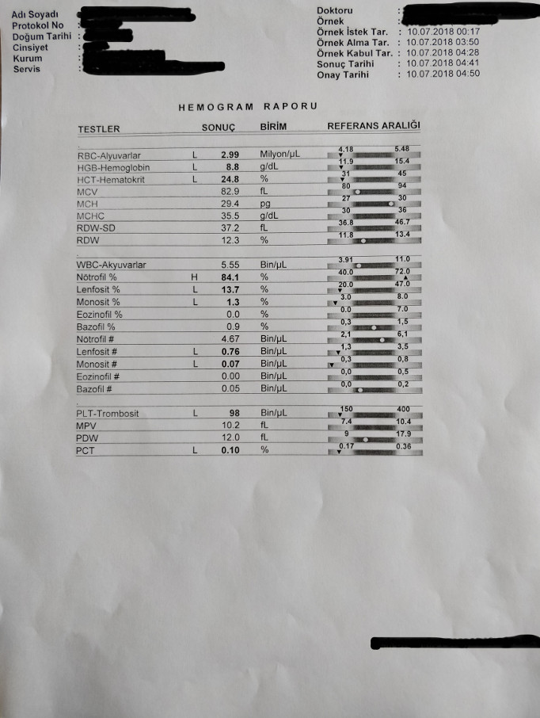

# Blood tests OCR

## Goals
* Parse blood tests from photos
* Store data in sqlite database
* Create statistics about how values changed with different conditions, correlations between values, other...

## How it works
1. User uploads a photo of blood test (in specific format, maybe can be expanded later, for now I need to get rid of tons of paper)
2. Date and list of values parsed from the document
3. OCR errors for the keys and values are corrected by the user on frontend (standard keys for entries supplied from the database)
4. Values saved to the database (there can be multiple tests with same date so list of values need to be expanded with new values)
5. Statistics can be built using accumulated data

## Technologies used
* [tesseract ocr](https://github.com/tesseract-ocr/tesseract) (in form of python bindings [pyocr](https://gitlab.gnome.org/World/OpenPaperwork/pyocr))
* [Flask](http://flask.pocoo.org/) - web API
* [PonyORM](https://ponyorm.com/) - for accessing sqlite database
* React/Redux/typescript for the frontend
* [Parcel](https://github.com/parcel-bundler/parcel) bundler for configurless builds

## Example of test format used

<br/>
Ocr will produce:
```json
{
    "date": "10.07.2018",
    "values": [["RBC-Alyvarlar", "2.99"], ...]
}
```

## Todo
- [x] Redux
- [x] React router
- [x] Save new
- [ ] Update (PATCH) existing with new values
- [ ] Add tag for the test (on frontend)
- [x] Ability to remove test entry
- [ ] Ability to add new entry 
- [ ] List of all tests
- [ ] Test edit/view
- [ ] Enhance OCR quality (for now there is a problem with parsing more complex test entry keys than "MCV" or "PLT-Trombosit")
- [ ] Statistics
    - [ ] Jupyter helper functions
    - [ ] Standalone graphs
